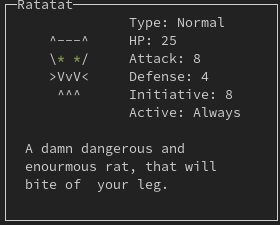
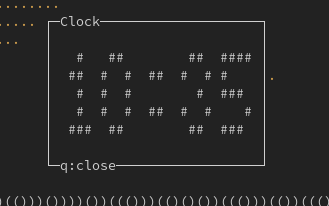

Soon the next bigger version (0.7.0) of `Pokete` will be released, but what new features will this bring and why the last bigger update has in 2021?
This is a more in depth Changelog.

## Under the hood
At first the biggest changes regard some under the hood stuff, like a restructuring of most of classes and their files. Many classes and functions formerly contained in the main `pokete.py` file have been moved to their own files, to better organize most of the code, and therefore singleton objects now can be initialized in their own files, and because of that can be just import by code depending on them, that also removes most of the dependency injection and shrinks function heads.

Also the introduction of the `PeriodicEventManager` (Pevm) reorganized some code and introduced a centralized approach to handling periodically occurring events on the Playmaps, like grass and water animations, which until now had their own functions managed via `extra_actions`.

Linting, the improvement of code-quality and documentation has been taken very seriously in this release, to lower the entry barricade to contributing to Pokete. Also logging has been added.

`pipenv` now also is supported and enables virtual environments and dependency management.

Also some of the escapecodes have been improved.

## Game design and behaviour
Not just under-the-hood things change, but also quite a lot of the game mechanics and design.

### Walkback
Now the player is forcefully returned to the last Pokete-Center they visited after the death of all their Poketes in their deck, so that cheating through the game by not being attacked by Poketes is now impossible. 

Also when a Pokete dies in a fight, the fight isn't instantly lost, but the player now is able to choose another Pokete to continue the fight.

### NPCs
NPCs are now way smarter and are now able to walk to certain areas of the map, regardless is which direction, also [multi-answer](https://github.com/lxgr-linux/pokete/pull/105) chats with NPCs are now passible, so that the player now is able to choose from some answers to give a NPC in a conversation, and depending on this the reactions of the NPCs vary.
All of the above also enables the addition of a storyline to the game, so that the player may get an antagonist or enemies in later releases.


### Achievements
A very cool new feature that really enhances the playing experience is the addition of achievements. Now achievements for certain actions, like the first fight or the first caught Pokete, are rewarded with an achievement. Therefore also an achievement overview in the menu has been added. 

### Cli
Now commandline options, to toggle logging, mods or the input methods have been added.

```
Pokete Grey Edition v0.6.4
Usage: ./pokete.py (<options>)
Options:
    --log          : Enables logging
    --help         : Shows this help
    --no_mods      : Disables mods
    --force-pynput : Forces the usage of pynput as a keyboard input backend

Homepage: https://github.com/lxgr-linux/pokete

All save and logfiles are located in ~/.cache/pokete/
Feel free to contribute.
See README.md for more information.
This software is licensed under the GPLv3, you should have gotten a
copy of it alongside this software.
Copyright (c) lxgr-linux <lxgr-linux@protonmail.com> 2022
```

### New Poketes
Newly added Poketes include
- [Voglus](https://github.com/lxgr-linux/pokete/blob/master/wiki.md#voglus), the evolvement of Voglo.


- [Ratatat](https://github.com/lxgr-linux/pokete/blob/master/wiki.md#ratatat), the evolvement of Rato.



- [Crabbat](https://github.com/lxgr-linux/pokete/blob/master/wiki.md#crabbat), which evolves from Clampi and to the also newly added [Rustacean](https://github.com/lxgr-linux/pokete/blob/master/wiki.md#rustacean), which I added because of my love to the Rust programming language.


- [Saugh](https://github.com/lxgr-linux/pokete/blob/master/wiki.md#saugh), an overpowered sand ghost that will definitely be nerfed later.


- [Corcos](https://github.com/lxgr-linux/pokete/blob/master/wiki.md#corcos-day)


- [Raupathor](https://github.com/lxgr-linux/pokete/blob/master/wiki.md#raupathor-day)


- [Mothor](https://github.com/lxgr-linux/pokete/blob/master/wiki.md#mothor) (more [info](#time))


### Maps
Ofcourse one of the highlights of a new release are the new maps. This release just two new maps have been added, but one of which is the most feature rich of them all.
Also most of the buildings like arenas or Pokete-Center and Shops now have signs on their roofs that show, what those buildings even are.

The first new map is [sunny beach](https://github.com/lxgr-linux/pokete/pull/107) where the newly added weather first came into play. It's located in the north of Rockville is the place where the new Crabbat, Rustacean and Saugh can be found.


But the biggest addition is the city of [Agrawos](https://github.com/lxgr-linux/pokete/pull/120) and being the biggest city in the game to far. It features the MowCow-Burger restaurant with a sidequest, the temple of the Wheeto, many NPCs, an arena, a town hall and many items to find. Also a new legendary old attack on a learning disc can be found there. To quote the minimap:

```
The great city of Agrawos,  
agricultural and cultural   
center of the whole region. 
It's famous for its great   
Pokete-Arena and its master trainer. Check out the      
MowCow-Burger restaurant,   
which offers the best,      
juiciest and most delicious 
Mowcow-burgers, cut from the
happiest and most delicious 
Mowcows anywhere to find!   
```


### Weather
The addition of weather has been made to change the effectivity balance on certain maps around and forces the player to change their play style.
So maps now have a different weather then others, that effect the effectiveness of some attacks, (rain makes water stronger and fire weaker; sun makes water weaker and fire stronger...).

### Notifications
Due to the addition of weather and achievements notifications had to be added, to inform the player of the weather or unlocked achievements.
I'm especially proud the slide animation of the notifications box, because it was a real hassle to get to work.


### Time
To further enhance the variety of Poketes [time](https://github.com/lxgr-linux/pokete/pull/123) has been added.
And because of this strictly night and day active Poketes are now possible, so that certain Poketes can just be caught at night, and also evolve to other Poketes then their day counterparts.

Because of this a new evolving line was added, starting with Corcos which has identical day and night versions, which both evolve to Raupathor.
But Rauphators day and night versions differ, not just that the night version has some blue accents in its artwork, but that the night has `undead` and the day version has `plant` as their secondary type. They also evolve to different Poketes, the night Raupathor evolves to Mothor and the day Raupathor to Schmetterling.

One ingame hour is the same as a realtime minute, but the time ingame time will stop after idling for two minutes.
Also a big Ascii clock was added to keep track of time. 



### Leveling
Because of the fact that leveling is a very lengthy and annoying thing to do, faster ways of doing so had to be added. 

#### Treats
One way to do so are [treats](https://github.com/lxgr-linux/pokete/pull/122), that can be found in Poketeballs and can be received from NPCs. One notable NPC is the candyman, who will try to gift you a treat every 24 ingame hours. After getting them, treats can be used to instantly level up a Pokete by one level.

#### Pokete-Care
Another way to level faster is to give a Pokete into Pokete-Care, in Pokete-Care a Poketes gets one XP per played ingame hour and can therefore be passively leveled. Only one Pokete at the time can be there.


### Appimages
For all the linuxusers out there an automatic Appimage build has been added to the releases.

### Natures
One last thing is the addition of [natures](https://github.com/lxgr-linux/pokete/pull/125), which manipulate the effectiveness of certain Poketes not on the race or level, but more on an individual level. The three natures effect attack defense and initiative values by a factor:

|Nature| Attack | Defense | Initiative |
|------|--------|---------|------------|
|Brave | 1.1 | 0.9 | 1 |
|Relaxed | 0.9 | 1.1 | 1 |
|Hasty | 1 | 0.9 | 1.1 |
|Normal | 1 | 1 | 1 |

This also varies by a grade what's either 1 or 2 and which potentiate the factors with them selves.